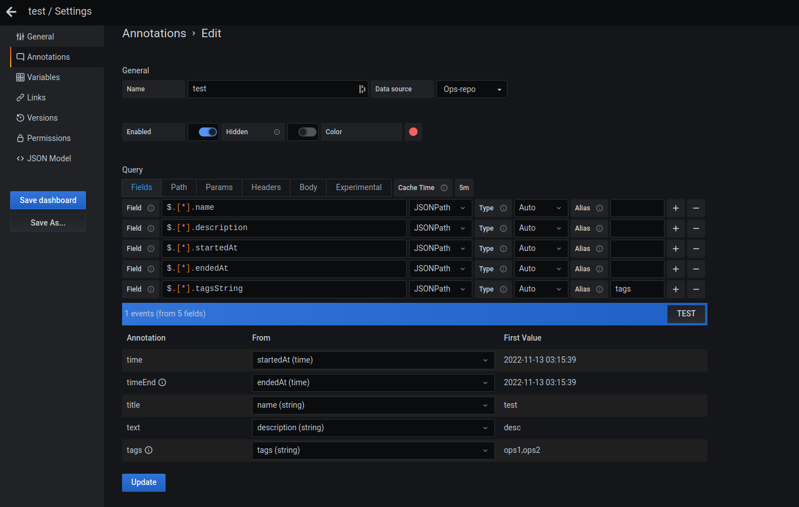

# Ops-repository

Make an history of your operations, and use it as an annotation source for Grafana.

This project is build on PHP/symfony/API platform, and expose a REST API.

swagger URL: /api/docs

## DataModel

**Operation**
* Name: string, max length 255
* Description: string, max length 255
* startedAt: datetime, optional, default = `now`
* endedAt: datetime, optional, default = `startedAt`
* createdAt: datetime, optional, default = `now`
* tags: array of strings
* tagsString: readonly, same as tags, but instead of returning an array, it return a string with `,` separator for each tag

**Tag**
* Name: must be uniq

## Security

**To be defined**

## Connection with Grafana

Use grafana JSON API plugin

1. Installation: https://grafana.github.io/grafana-json-datasource/installation
```
grafana-cli plugins install marcusolsson-json-datasource
```

2. add Json datasource
  * host: http://api/api/operations
  * headers: "Accept: application/json"
3. Add annotation source in dashboard:
  * fill each fields:
    * `$.[*].name`
    * `$.[*].description`
    * `$.[*].startedAt`
    * `$.[*].endedAt`
    * `$.[*].tagsString`
4. OPTIONAL Filter operations, by adding in the tab `params` some key/values:
  * By operations tags: key => tags, value => tag1,tag2
  * By dates from & to
    * from: key => from, value => `$__isoFrom()`
    * to: key => to, value => `$__isoTo()`



## Start local develop

**API**

1. Setup the database
```
docker-compose up -d db-update
```
2. Start the API
```
docker-compose up -d api
```

Run tests:
```
docker-compose exec api php bin/phpunit --coverage-html var/code_coverage/
```

**UI**
Not working
```
docker-compose run ui npm install
docker-compose up -d ui
```


## Knowledge base

### Project init - don't run it, only for knowledge

```
docker run --rm -it -v $PWD/api2:/app -u $(id -u):$(id -g) composer create-project symfony/skeleton:"6.*" .
docker run --rm -it -v $PWD/api2:/app -u $(id -u):$(id -g) composer require apiplatform
docker run --rm -it -v $PWD/api2:/app -u $(id -u):$(id -g) composer require webapp
docker run --rm -it -v $PWD/api2:/app -u $(id -u):$(id -g) composer require annotations
docker run --rm -it -v $PWD/api2:/app -u $(id -u):$(id -g) composer require twig
```
